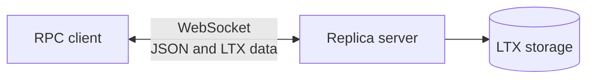
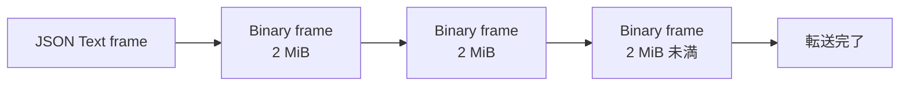
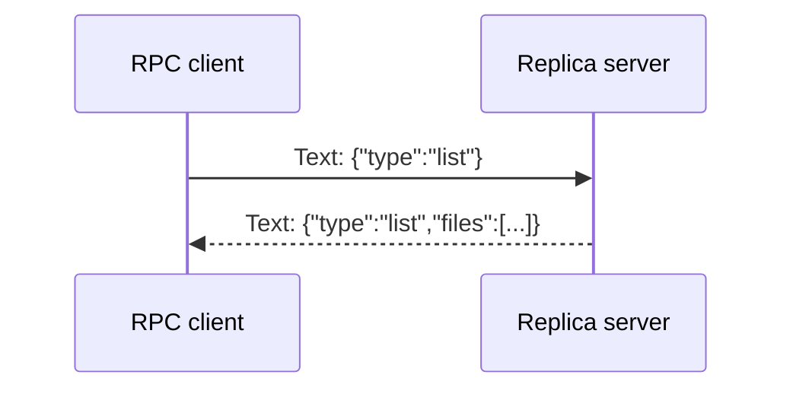
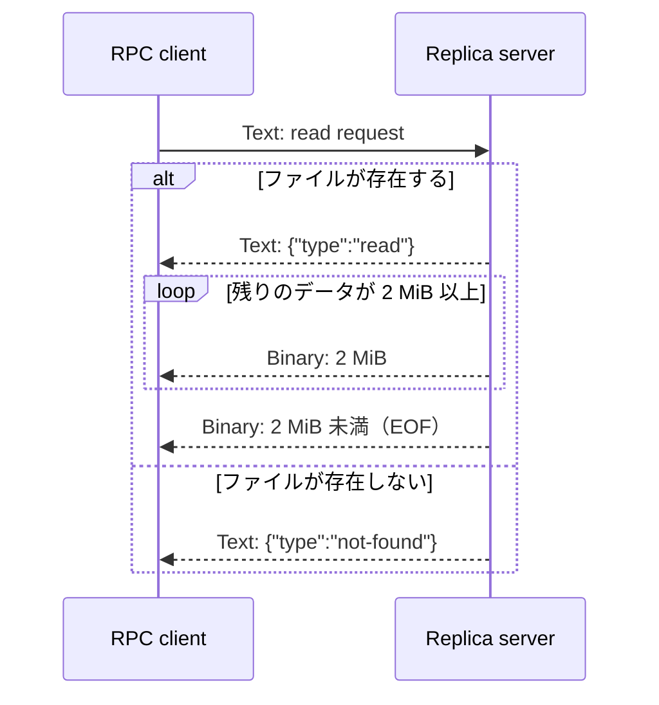
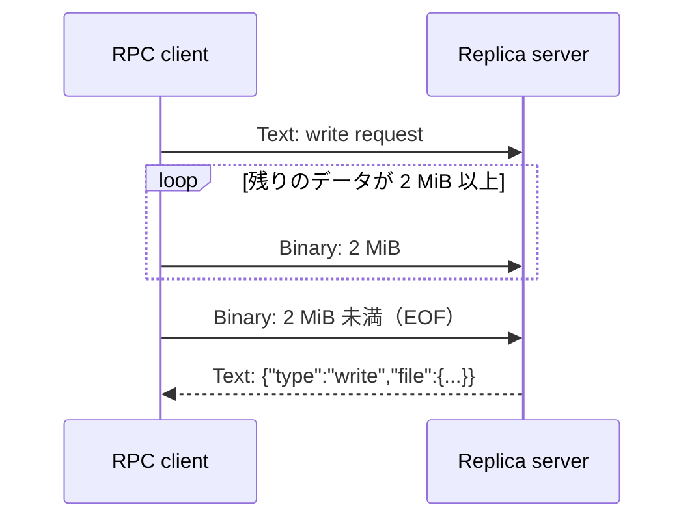
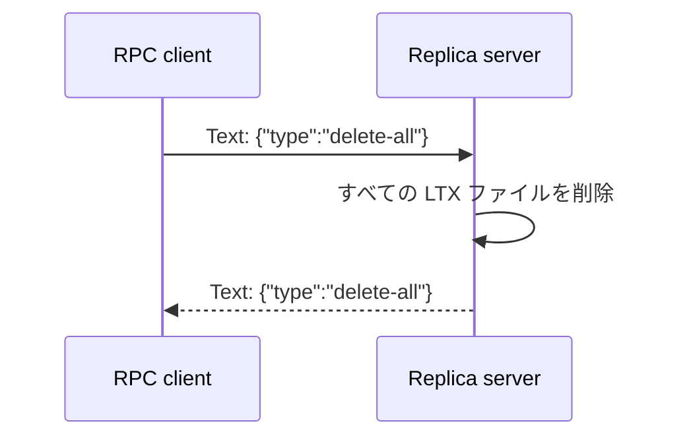

# LTX WebSocket RPC プロトコル

この文書は [`grafana/ltx/replica.go`](../grafana/ltx/replica.go)
で使用する WebSocket RPC プロトコルをまとめたものです。LTX ファイルを保管する
リモートサーバーに対して、ファイルの一覧取得、読み書き、削除を行います。

## 概要

- トランスポートは WebSocket です。
- リクエストとレスポンスは JSON を格納した Text frame です。
- LTX ファイル本体は Binary frame の列として送受信します。
- リクエスト ID やレスポンス ID はなく、同じ接続上の要求と応答は送信順で対応します。
- JSON の TXID は 16 桁、ゼロ埋め、小文字の 16 進文字列です。
- `created_at` は Unix time の秒です。



## 共通データ型

### リクエスト

```json
{
  "type": "list | read | write | delete | delete-all",
  "read_file": {},
  "write_file": {},
  "delete_files": {}
}
```

`type` に対応するペイロードだけを設定します。値のない省略可能フィールドは JSON に
出力されません。

### レスポンス

```json
{
  "type": "list | read | write | delete | delete-all | not-found",
  "files": [],
  "file": {}
}
```

### ファイル情報

```json
{
  "level": 0,
  "min_txid": "0000000000000001",
  "max_txid": "000000000000000a",
  "size": 12345,
  "created_at": 1700000000
}
```

| フィールド   | 型      | 意味                        |
| ------------ | ------- | --------------------------- |
| `level`      | integer | Litestream の圧縮レベル     |
| `min_txid`   | string  | ファイルに含まれる最小 TXID |
| `max_txid`   | string  | ファイルに含まれる最大 TXID |
| `size`       | integer | LTX ファイルのバイト数      |
| `created_at` | integer | 作成日時（Unix time、秒）   |

## バイナリ送信

`read` と `write` では、JSON の制御メッセージに続けて LTX データを Binary frame の
列として送信します。

- 1 frame の最大サイズは 2 MiB (`2097152` bytes) です。
- 2 MiB の frame は、後続 frame があることを示します。
- 2 MiB 未満の frame は、データ本体とその終端を兼ねます。
- データ長が 2 MiB の整数倍の場合は、終端を示す長さ 0 の Binary frame を送ります。
- データ列の途中に Text frame や 2 MiB 未満の Binary frame を挿入できません。



## RPC

### `list`: ファイル一覧

ペイロードを付けずに全ファイルを要求します。

```json
{ "type": "list" }
```

サーバーはファイル情報の配列を返します。空の一覧でも `files` は省略せず、空配列に
する必要があります。

```json
{
  "type": "list",
  "files": [
    {
      "level": 0,
      "min_txid": "0000000000000001",
      "max_txid": "000000000000000a",
      "size": 12345,
      "created_at": 1700000000
    }
  ]
}
```

この RPC に検索条件はなく、絞り込みが必要な場合は受信側で行います。



### `read`: ファイル読み出し

`level`、TXID の範囲、および読み出すバイト範囲を指定します。

```json
{
  "type": "read",
  "read_file": {
    "level": 0,
    "min_txid": "0000000000000001",
    "max_txid": "000000000000000a",
    "offset": 0,
    "size": 12345
  }
}
```

ファイルが存在する場合、サーバーは最初に `read` レスポンスを返し、続けて要求範囲の
データを Binary frame で送信します。



ファイルが存在しない場合は `{"type":"not-found"}` を返し、Binary frame は送信しません。

### `write`: ファイル書き込み

最初にメタデータを Text frame で送り、続けて LTX ファイル全体を Binary frame で
送ります。

```json
{
  "type": "write",
  "write_file": {
    "level": 0,
    "min_txid": "0000000000000001",
    "max_txid": "000000000000000a",
    "created_at": 1700000000
  }
}
```

`created_at` は LTX ヘッダーのミリ秒精度の timestamp を Unix time の秒へ変換した
値です。



サーバーは Binary frame の終端を受信し、ファイルを保存し終えてから保存結果の
ファイル情報を返します。

```json
{
  "type": "write",
  "file": {
    "level": 0,
    "min_txid": "0000000000000001",
    "max_txid": "000000000000000a",
    "size": 12345,
    "created_at": 1700000000
  }
}
```

### `delete`: 指定ファイルの削除

削除対象をファイル情報の配列で送ります。

```json
{
  "type": "delete",
  "delete_files": {
    "files": [
      {
        "level": 0,
        "min_txid": "0000000000000001",
        "max_txid": "000000000000000a",
        "size": 12345,
        "created_at": 1700000000
      }
    ]
  }
}
```

サーバーは削除完了後に次のレスポンスを返します。

```json
{ "type": "delete" }
```

### `delete-all`: 全ファイルの削除



## 接続の再利用

1 回の RPC が完了した WebSocket 接続は、後続の RPC に再利用できます。ここでいう
完了は、JSON レスポンスに加えて、`read` / `write` では Binary frame の送受信も
終端まで完了した状態を指します。

リクエスト ID がないため、1 本の接続上で複数の RPC を並行実行することはできません。
後続リクエストは、先行 RPC のレスポンスとバイナリ送信が完了してから送信します。
バイナリ送信を途中で中止した接続やプロトコルエラーが発生した接続は、後続 RPC に
再利用せず閉じます。

## エラーの扱い

レスポンスの `type` が要求に対応する値でない場合や、必要な `files` / `file`
フィールドがない場合はプロトコルエラーです。明示的に定義されているエラー
レスポンスは `read` に対する `not-found` だけです。それ以外のエラー形式や再試行、
認証、プロトコルのバージョンネゴシエーションは定義されていません。
